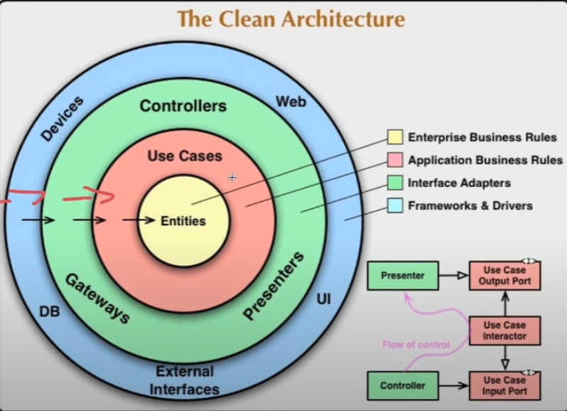

# Exemplo de API Spring Boot

Este projeto é um exemplo simples de uma API construída usando Spring Boot, seguindo os princípios da Clean Architecture para garantir que o design do sistema seja robusto, testável e fácil de manter.

## Clean Architecture

A Clean Architecture é organizada em camadas concêntricas, cada uma representando diferentes áreas de responsabilidade:

- **Entities**: No núcleo estão as Entidades, que representam os objetos de domínio e as regras de negócio que são independentes do framework utilizado.
- **Use Cases**: Em torno das Entidades, temos os Casos de Uso (Use Cases), que contêm a lógica de aplicação específica e as regras de negócio.
- **Interface Adapters**: Esta camada contém adaptadores que convertem dados do formato mais conveniente para os casos de uso e entidades, para o formato mais conveniente para algum agente externo como o Banco de Dados (DB) ou a Interface do Usuário (UI).
- **Frameworks & Drivers**: A camada mais externa é composta por frameworks e drivers que incluem a UI, o banco de dados, e qualquer outra ferramenta como servidores web ou frameworks de dispositivos.

As dependências entre essas camadas seguem uma regra de dependência externa, significando que as camadas internas não dependem das camadas externas, mas as externas podem depender das internas.

## Tecnologias Utilizadas
// Restante do conteúdo anterior...
